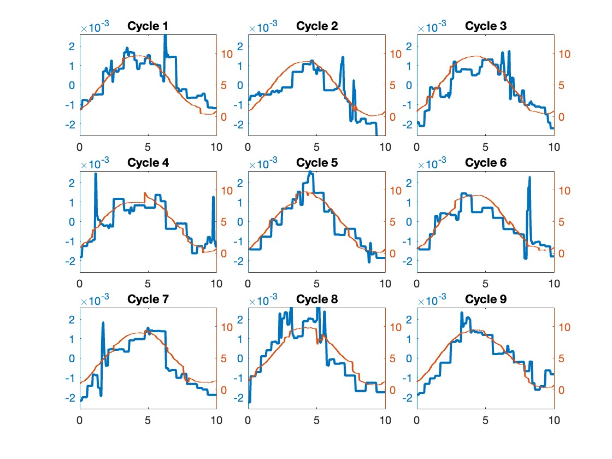
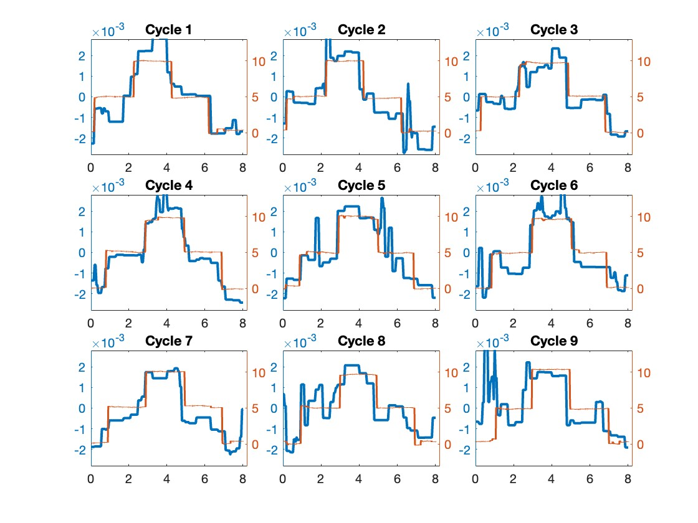
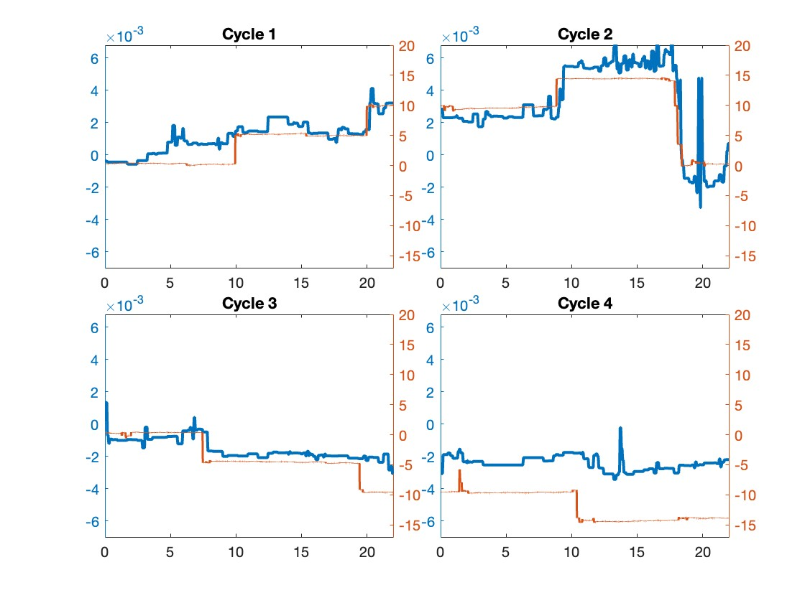
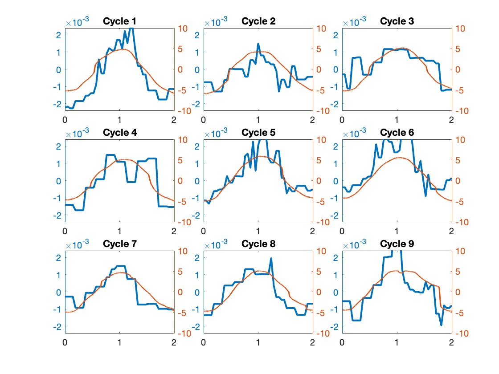
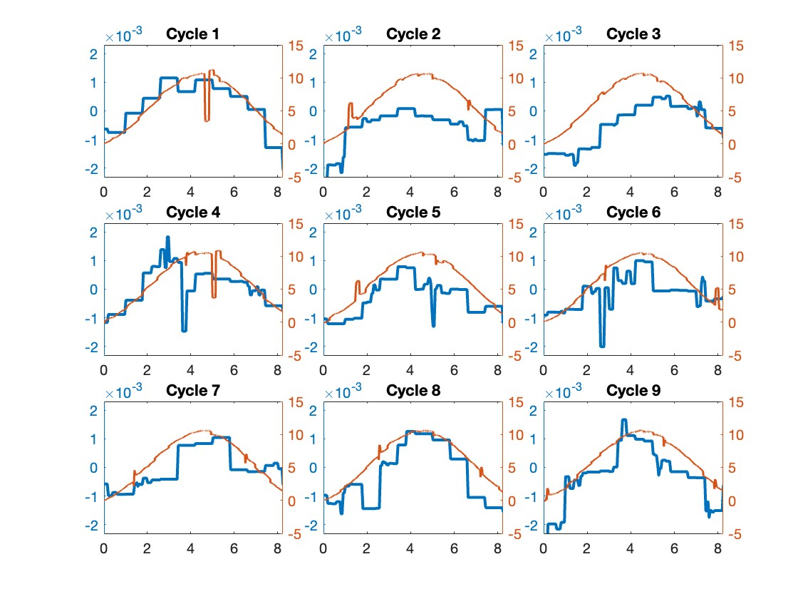
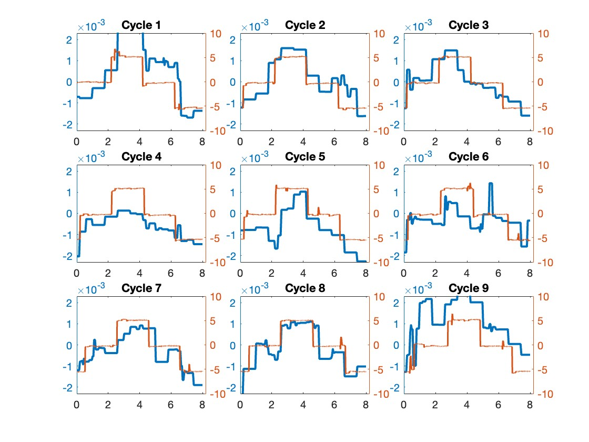
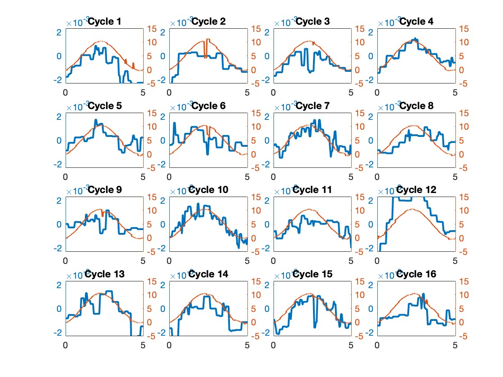

# primateEyeTracker_Data
<h1>
  Current status:
</h1>

  Under review...

<h1>
  What's this:
</h1>

  This is the support data for the capacitive primateEyeTracker research paper.  
  <ul>
    <li>
      Folder: script and data/dataset1 contains data for main result throughout the paper. 
    </li>
    <li>
      Folder: script and data/dataset2_3_ML contains data for additional result dataset 2,3 and machine learning using different sets.
    </li>
    <li>
      Files end with ".mat" are MATLAB date stores; they contain the unprocessed capacitive readings and reference sclera coil signals. 
    </li>
    <li>
      Files end with ".mlx" are MATLAB LiveScripts; run them with ".mat" files recreate the data processing steps and final result.
    </li>
  </ul>
  

<h1>
  Prerequisite to run this:
</h1>

  Created with MATLAB 2023a (Version 9.14), older version may work.  
  Requires Wavelet Toolbox (Version 6.3), older version may work.  
  Requires Statistics and Machine Learning Toolbox (Version 12.5), older version may work.

<h1>
  Where can I find the paper/ or preprint?
</h1>

  More details coming...

<h1>
  Results from attached processing Scripts.
</h1>
<h2> 
  Horizontal Movements: 
</h2>
  <ol>
    <li> 
      <h3> Horizontal Smooth Pursuit</h3>
        
 Horizontal Smooth Pursuit, 9 slices 

        
    </li>
    <li> 
      <h3> Horizontal Saccade Tracking </h3>
        
 Horizontal Saccade Tracking, 9 slices 

        
    </li>
    <li> 
      <h3> Horizontal Fixation </h3>
        
 Horizontal Saccade Tracking, 9 slices 

        
    </li>
    <li> 
      <h3> Horizontal Smooth Pursuit 0.5 hz </h3>
        
 Horizontal Smooth Pursuit 0.5 hz, 9 slices 

        
    </li>
  </ol>
  
<h2> 
  Vertical Movements: 
</h2>
  <ol>
    <li> 
      <h3> Vertical Smooth Pursuit</h3>
        
 Vertical Smooth Pursuit, 9 slices 

        
    </li>
    <li> 
      <h3> Vertical Saccade Tracking </h3>
        
 Vertical Saccade Tracking, 9 slices 

        
    </li>
    <li> 
      <h3> Vertical Smooth Pursuit 0.2 hz </h3>
        
 Vertical Smooth Pursuit 0.2 hz, 16 slices 

        
    </li>
  </ol>

